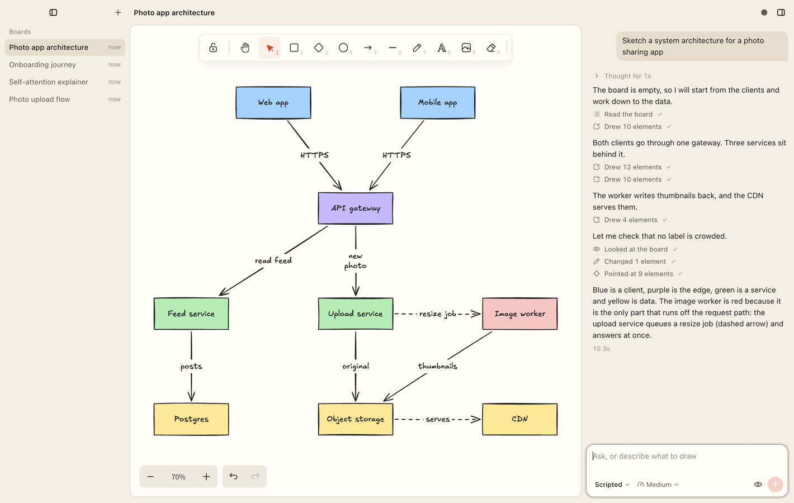
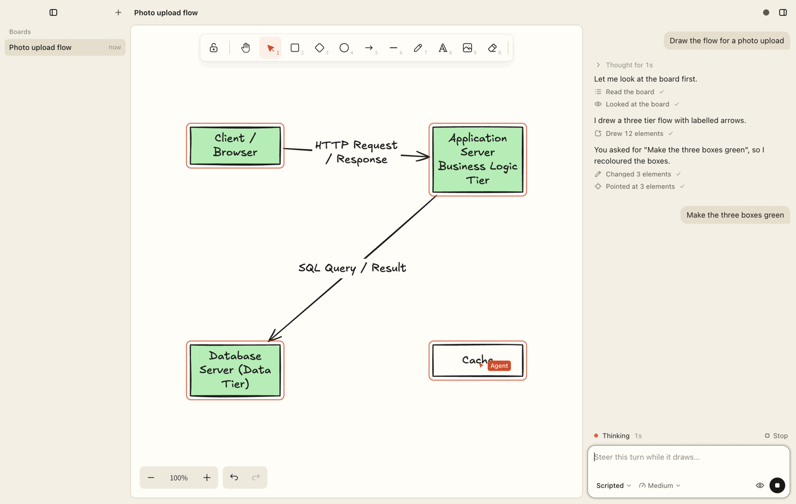
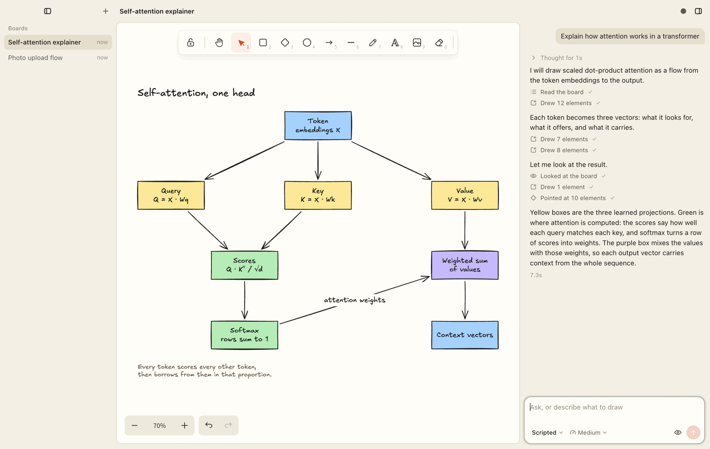
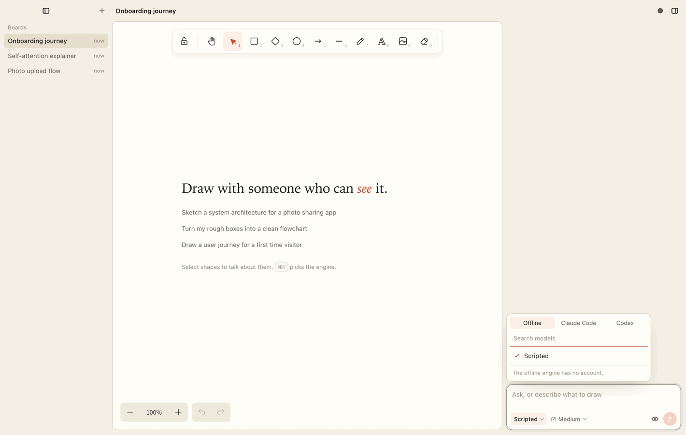
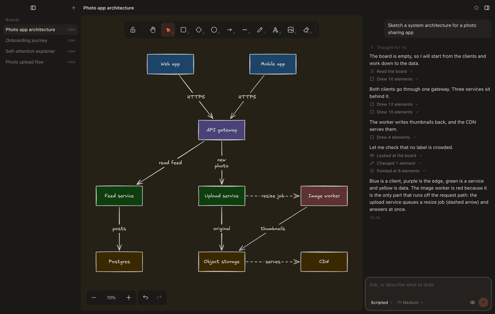
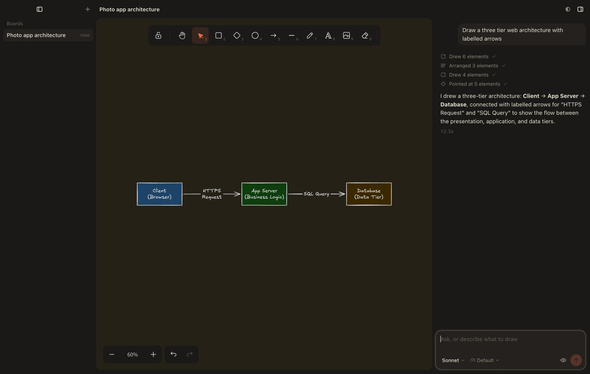
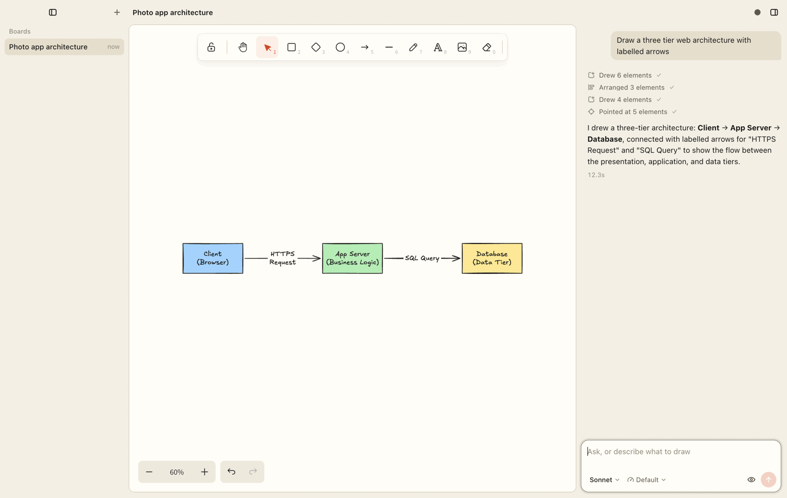

<picture>
  <source media="(prefers-color-scheme: dark)" srcset="docs/brand/lockup-dark.svg">
  
</picture>

Easel is a desktop application in which a person and a coding agent draw on one Excalidraw board.

Easel is a showcase for [Reins](https://github.com/serhiitroinin/reins). It is not a packaged product.

<picture>
  <source media="(prefers-color-scheme: dark)" srcset="docs/screenshots/hero-dark.png">
  
</picture>

## What it shows

A terminal agent session can describe a diagram. It cannot work on the surface
that you work on. Easel adds four capabilities:

- **A shared board.** The window holds one Excalidraw scene. The person and the
  agent change it at the same time. Easel merges the changes of the agent by
  element id.
- **Sight.** The `view_canvas` tool returns a PNG picture of the board as an
  image tool result. The agent can see a freehand sketch, and it can examine
  its own drawing.
- **A typed reference.** When you select elements and send a message, Easel
  adds a `context-reference` input part with the ids of the selected elements.
  "Make these green" then refers to elements, not to a guess.
- **Steering in a turn.** The composer stays active while the agent draws. A
  message that you send during a turn goes to the same turn through
  `run.followUp`.

Easel also shows these Reins functions:

- The engine menu comes only from `profile()`, `models()`, and `limits()`.
  Easel contains no list of models. The Codex "Speed" setting is a generic
  control, and Easel has no code that is specific to Codex in the interface.
- Two context sources give each turn the drawing rules, the board, the
  selection, and the changes that the person made after the last turn.
- File persistence stores the events of each turn. When you open a board again,
  Easel shows the full chat.

## Requirements

- macOS 12 or newer. Easel is not tested on Windows or Linux.
- [Bun](https://bun.sh) 1.3 or newer.
- Node.js 22 or newer.
- For a live engine: the Claude Code command-line tool (`claude`) or the Codex
  command-line tool (`codex`) on your `PATH`, signed in to your account. Easel
  was tested with Claude Code 2.1 and Codex 0.154.
- For the offline engine: no account and no network.

## Install and run

```sh
git clone https://github.com/serhiitroinin/easel.git
cd easel
bun install
bun run dev
```

`bun run dev` builds the application and starts it. After the first build, you
can use `bun run start` to start it without a build.

To use the offline engine, run this command:

```sh
bun run dev:offline
```

The offline engine is a scripted engine. It does not contact a provider, and it
uses the same tools, context sources, and event stream as a live engine. The
prompt selects the drawing:

| The prompt contains | The offline engine draws |
| --- | --- |
| `architecture` or `system` | A system architecture with four colour groups |
| `attention` or `transformer` | A diagram that explains self-attention |
| Other text | A flow with three tiers |

Easel stores its data in the Electron `userData` directory. `boards/` contains
the board files. `harness/` contains the Reins events and session checkpoints.
Set `EASEL_DATA_DIR` to use a different directory.

## How it uses Reins

These files are the full integration. `wc -l` gives the line counts.

| File | Lines | Function |
| --- | ---: | --- |
| `src/main/harness/engines.ts` | 213 | Makes the Claude Code adapter and the Codex adapter. Each adapter has live discovery and permits only the canvas tools. |
| `src/main/runs.ts` | 156 | Starts, streams, steers, and cancels one turn for each board. |
| `src/main/harness/offline.ts` | 147 | The offline engine, made with `createScriptedAdapter`. |
| `src/main/harness/offline-scenes.ts` | 219 | The drawings of the offline engine. |
| `src/main/harness/tools.ts` | 99 | The seven canvas tools, given to `createToolHost`. |
| `src/main/harness/tool-schemas.ts` | 79 | The closed JSON Schema of each tool. |
| `src/main/harness/context.ts` | 68 | The two context sources: the trusted guide and the untrusted board. |
| `src/main/harness/host.ts` | 63 | Calls `createHarness` with the adapters, file persistence, the tools, and the context sources. |
| `src/main/canvas-bridge.ts` | 46 | Sends a canvas command from the main process to the window, with a time limit. |
| `src/main/harness/guide.ts` | 37 | The instruction text that the agent receives in each turn. |
| **Total** | **1127** | |

The other code is the application: 968 lines of shared canvas logic in
`src/shared/` and 3048 lines of TypeScript in `src/renderer/`.

The agent has these tools:

| Tool | Function |
| --- | --- |
| `get_scene` | Returns the board as JSON: ids, types, positions, sizes, text, colours, author, arrow bindings, the visible area, and the selection. |
| `view_canvas` | Returns a PNG picture of the visible area, the selection, or the full board. |
| `add_elements` | Draws shapes, text, bound arrows, and frames. Easel puts an element without coordinates in free space. |
| `update_elements` | Moves, resizes, recolours, or changes the text of elements by id. |
| `delete_elements` | Removes elements by id. |
| `arrange` | Puts elements in a row, a column, or a grid, or aligns them. |
| `focus` | Scrolls and zooms the view of the person to elements. |

[docs/ARCHITECTURE.md](docs/ARCHITECTURE.md) describes the processes and the
data flow. [docs/REINS_INTEGRATION.md](docs/REINS_INTEGRATION.md) gives the
integration facts for a person who builds an application on Reins.

## Safety

The agent can do these things:

- Call the seven canvas tools.
- Read the board and the selection that Easel sends with each turn.

The agent cannot do these things:

- Run a shell command, read a file, write a file, or use the network. Claude
  Code runs with no built-in tools, no skills, and no settings files. Codex
  runs with its shell tools off, a read-only sandbox, and the `never` approval
  policy.
- Call a tool that is not a canvas tool. `authorizeTool` refuses each tool
  name that does not start with `mcp__reins__`.
- Read your environment. Each engine process receives only a short list of
  environment variables.

Easel contains the content that the agent writes:

- Each tool has a closed JSON Schema, and Easel validates each input again
  before the canvas changes.
- Each element that the agent draws has the mark `customData.author = "agent"`.
  You can undo each change of the agent with ⌘Z.
- Easel puts new elements in free space. The agent cannot put an element on
  top of your work by accident.
- Text on the board is untrusted data. Easel tells the agent not to follow
  instructions in that text.
- The window runs in the Chromium sandbox with context isolation. Its Content
  Security Policy permits no remote script, font, or connection. A link in the
  chat opens in your browser.

Easel does not isolate the engine process from the operating system. The
engine command-line tool runs with the permissions of your user account.

## Screens

| | |
| --- | --- |
|  |  |
| You send a second message while the agent draws. The agent changes the colours in the same turn. The red outline and the red cursor show the work of the agent. | The agent adds the diagram in steps. Each step is one tool row in the chat. |
|  |  |
| The engine menu shows the engines, the models, and the account limits that Reins discovers. The composer shows the model button and the effort button. | The dark theme. Easel follows the system theme, and the button in the top bar overrides it. |
|  |  |
| A live turn on Claude Code with the Sonnet model. The pictures above come from the offline engine; these two come from a real engine and differ from run to run. | The same board in the light theme. |

## Limits

- Easel has no application bundle, no installer, and no code signing.
- Easel is tested only on macOS.
- `add_elements` makes a frame only from elements in the same call.
- Easel calculates the route of a bound arrow from its two shapes. It ignores
  coordinates that the agent gives for a bound arrow.
- A labelled arrow needs clear space between its two shapes. Easel refuses the
  arrow when the space is too small. If you drag the two shapes together
  afterwards, the label can overlap them.
- After a turn, the board zooms to show the new drawing. It does not zoom when
  you moved the view during the turn. It does not zoom above 100%.
- The dark theme of Excalidraw inverts the colours of the canvas. A pastel fill
  becomes a dark, saturated fill. The guide tells the agent to use a fill only
  when the fill has a meaning.
- Elements do not fade in. Only the outline and the cursor of the agent move.
- When you change the engine on a board, the new engine starts a new session.
  It receives the board, but it does not receive the earlier chat.
- The `validate` hook of `createToolHost` replaces the message of a thrown
  error with a generic message. Easel validates in `execute` and returns the
  detailed message to the agent.

## Development

```sh
bun run typecheck        # TypeScript, main process and renderer
bun test                 # unit tests
bun run check:offline    # builds, starts the application, and runs one offline turn
bun run screenshots      # builds and writes docs/screenshots again
```

The scripts in `scripts/` start a separate copy of Easel with a temporary data
directory. They do not read or change your boards. Run `bun run build` before
you run one of them directly.

| Script | Engine | Function |
| --- | --- | --- |
| `scripts/offline-check.ts` | Offline | Runs one turn and examines the board, the arrow labels, and the composer layout. |
| `scripts/layout-check.ts` | Offline | Examines the sidebar, the narrow composer, the menus, and the tool rows. With the argument `live`, it uses live discovery and runs no turn. |
| `scripts/screenshots.ts` | Offline | Writes the pictures in `docs/screenshots/`. |
| `scripts/picker-check.ts` | Live discovery | Prints the models and limits that the engine menu shows. It runs no turn. |
| `scripts/effort-check.ts` | Live discovery | Examines the effort button for each engine. It runs no turn. |
| `scripts/discovery-check.ts` | Live turns | Runs one small turn on each engine and reads the limits again. |
| `scripts/live-check.ts` | Live turns | Runs a drawing turn on one engine. |
| `scripts/live-sketch.ts` | Live turns | Draws a freehand sketch and asks the agent to describe it. |
| `scripts/live-shots.ts` | Live turns | Writes the live pictures in `docs/screenshots/`. `bun run screenshots:live` builds first. |

A script with live turns uses your Claude Code or Codex account. Only
`scripts/screenshots.ts` and `scripts/live-shots.ts` write into the
repository. Each other script writes its captures into a new temporary
directory. Set `EASEL_SHOTS_DIR` to select
the directory.

### Screenshots

`scripts/screenshots.ts` uses the offline engine, so the pictures are
repeatable and show no account data. It sets the window to 1420 × 900, captures
at 2x, and scales each picture to 1420 pixels wide with `sips`. It then reduces
the colours with `pngquant` or ImageMagick (`magick`) if one of them is
installed. Do not commit a picture that shows a plan name, a usage value, or a
reset time.

`scripts/live-shots.ts` runs one drawing turn on a real engine and writes
`live-<tag>-dark.png` and `live-<tag>-light.png`. Its arguments are the engine
name, the model name, and the file tag; the default is `"Claude Code" Sonnet
claude`. The pictures differ from run to run. The script never captures the
engine menu, so the pictures show no account data.

If you use the AeroSpace window manager, the scripts set the Easel window to
floating. A tiled window cannot keep the capture size.

### The control port

The scripts operate the window through a control port. The control port is an
HTTP server in the main process that can run JavaScript in the window, resize
the window, and write a capture to a file path.

- The control port is off in a normal launch. `bun run start` and `bun run dev`
  do not open it.
- It opens only when both `EASEL_CONTROL_PORT` (1024 to 65535) and
  `EASEL_CONTROL_TOKEN` (16 characters or more) are set.
- It listens only on `127.0.0.1`.
- Each request must contain the token in the `x-easel-control-token` header. A
  web page in a browser cannot send this header to the port.
- `scripts/drive.ts` sets both variables for the copy of Easel that it starts.
  It makes a new random token for each run. The default port is 39217.
- `tests/control.test.ts` verifies that an environment without these variables
  starts no server.

Do not set these variables when you use Easel for your own work.

## License

Easel is licensed under the [MIT License](LICENSE). [THIRD-PARTY.md](THIRD-PARTY.md)
lists the licenses of the dependencies, the fonts, and the icons.
